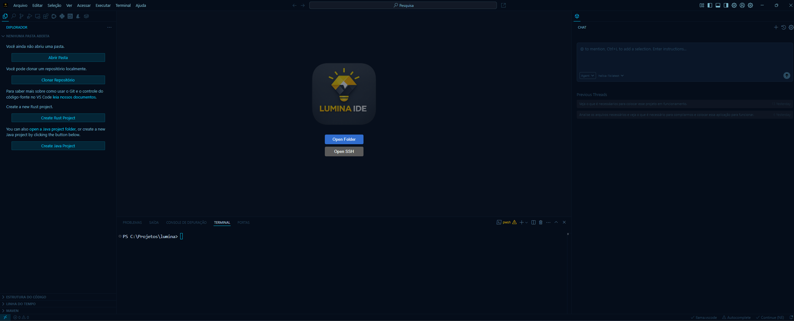
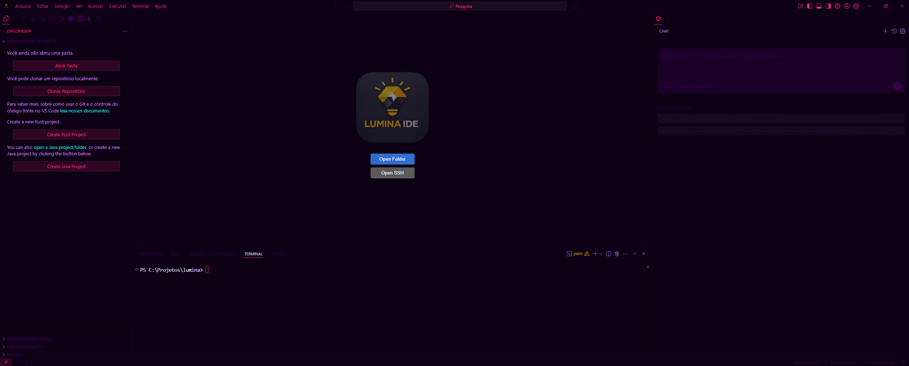
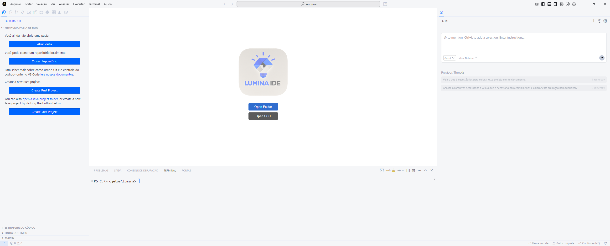
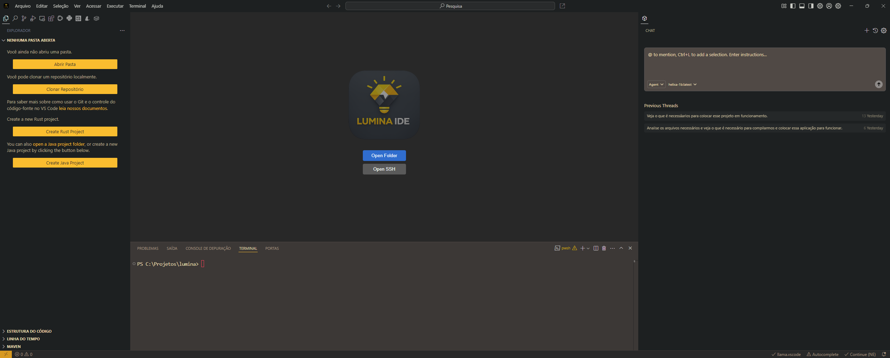

# Lumina Themes Suite 🎨

The official, curated color theme suite for **Lumina IDE** and **VS Code**. Designed for maximum readability, sleek modern aesthetics, vibrant syntax highlights, and comfortable long coding sessions.

---

## 🌟 Included Themes

This extension package includes 4 distinct themes tailored for different coding environments and lighting conditions:

### 1. 🌌 Lumina Dark (Default)
Deep navy & slate background with vibrant cyan, violet, and gold syntax highlights. Optimized for low-light environments and long coding sessions.

---

### 2. ⚡ Lumina Cyberpunk
High-contrast neon aesthetic with electric blues, hot magenta, and neon green accents. Designed to make your code pop on screen.

---

### 3. ☀️ Lumina Light
Clean, high-legibility light theme featuring soft off-white backgrounds, dark charcoal text, and crisp accent colors. Ideal for bright environments.

---

### 4. 🟡 Lumina Yellow
Warm dark theme with golden amber highlights and deep charcoal backgrounds, providing an energetic and focused coding experience.

---

## 🚀 Installation & Usage

1. Install **Lumina Themes Suite** from the Marketplace (or via `.vsix`).
2. Open the Theme Selector in Lumina / VS Code:
   * **Windows / Linux:** `Ctrl` + `K` then `Ctrl` + `T`
   * **macOS:** `Cmd` + `K` then `Cmd` + `T`
3. Select any of the 4 Lumina themes:
   * `Lumina Dark`
   * `Lumina Cyberpunk`
   * `Lumina Light`
   * `Lumina Yellow`

---

## 🤝 Feedback & Contributions

Report issues or submit suggestions on our GitHub repository:  
[https://github.com/lumina-ide/lumina](https://github.com/lumina-ide/lumina)

**Enjoy coding with Lumina! 🚀**
